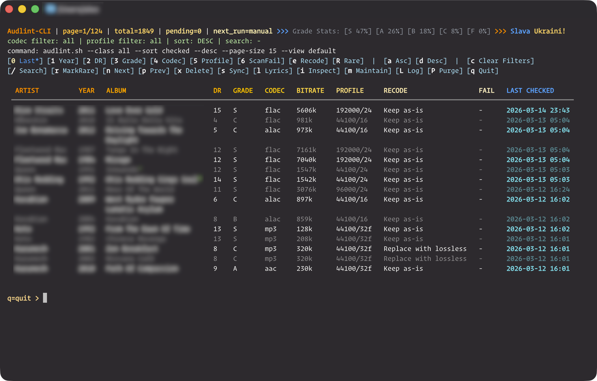
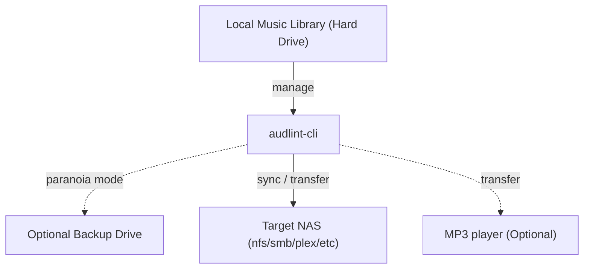

# audlint-cli

## What it is

`audlint-cli` is a source-available terminal audiophile toolkit for browsing a music library, checking audio quality, and deciding what should stay as-is, be rescanned, or be re-encoded.



### Main features

- Interactive library browser with filters, album inspection, compare album directories, and maintenance controls
- Album and track analysis driven by DR, true peak, codec/profile detection, and spectral checks
- Recode decision support shared across the browser, maintenance scans, and conversion tools
- Utility scripts for CUE splitting, FLAC conversion, gain application, album-art normalization/fetch, lyrics fetching, sync, and spectrogram generation

## What it does

`audlint-cli` treats your local library as the source of truth, then helps you review it, keep it healthy, and move finished albums where they need to go. It can spot fake hi-res or upscaled material and recommend leaner lossless targets to save disk space while making source flaws visible. It uses SoX (`sox_ng`) for the actual audio processing.



## Documentation

- Docs index: [docs/README.md](./docs/README.md)
- Additional tools: [docs/tools.md](./docs/tools.md)
- Spectrogram generation guide: [docs/spectre.md](./docs/spectre.md)

## Library layout

`audlint-cli` has been tested only with libraries organized in this style:

```text
<library root>/
  A/
    <artist>/
      <year> - <album>/
      <year> - <album>/
      <year> - <album>/
    <artist>/
      <year> - <album>/
      <year> - <album>/
  B/
    <artist>/
      <year> - <album>/
      <year> - <album>/
      <year> - <album>/
```

In other words, the library root contains letter buckets such as `A`, `B`, and `C` for the first letters of artist names; each letter bucket contains artist folders, and each artist folder contains album folders named like `<year> - <album>`.

## Dependencies

Required runtime tools:

- Bash 5 (`bash`, recommended via package manager if system bash is older)
- `sqlite3`
- `ffmpeg`, `ffprobe`
- `sox`, `soxi` — sox_ng recommended; handles ALAC/AAC in M4A containers
- `metaflac` — tag copy after FLAC encode
- `dr14meter` — DR14 dynamic range measurement (installs to `~/.local/bin` via `pip install dr14meter`)
- `zip` — backup bundle rotation/verification
- `rsync` — transfer/sync workflows to a mounted destination directory
- `crontab` (`cron` on Debian/Ubuntu, `cronie` on Fedora) for scheduled maintenance
- Python 3 with `numpy` — FFT spectral analysis
- Python 3 with `opencv-python` (`cv2`), `numpy`, and `tesseract` binary — spectrogram image OCR utility (`audlint-spectre.sh`)
- Python 3 with `rich` — table rendering (or set `RICH_TABLE_CMD` to a compatible renderer)

### Install in a few commands

macOS (Homebrew):

```bash
brew update
brew install bash sqlite ffmpeg sox flac rsync tesseract python
python3 -m pip install --user --upgrade pip
python3 -m pip install --user numpy opencv-python rich dr14meter
```

Debian/Ubuntu:

```bash
sudo apt update
sudo apt install -y bash sqlite3 ffmpeg sox flac rsync cron tesseract-ocr python3 python3-pip zip
python3 -m pip install --user --upgrade pip
python3 -m pip install --user numpy opencv-python rich dr14meter
```

Fedora:

```bash
sudo dnf install -y bash sqlite ffmpeg sox flac rsync cronie tesseract python3 python3-pip zip
python3 -m pip install --user --upgrade pip
python3 -m pip install --user numpy opencv-python rich dr14meter
```

macOS already ships `/usr/bin/zip`, so Homebrew does not need an extra package for it.

If Fedora does not provide `ffmpeg` in your enabled repos, enable RPM Fusion Free (or use `ffmpeg-free`).

If `dr14meter` is installed with `--user`, ensure your user bin directory is on `PATH`.

`spectre.sh` (audio spectrogram generation) requires:
- `ffmpeg`, `ffprobe`

Optional format helpers:

- `eyeD3` — preferred for MP3 tag and embedded-art rewrites
- `AtomicParsley` — preferred for M4A/ALAC tag and embedded-art rewrites

Optional development tools:

- `shellcheck` (used by `make lint`)
- `shfmt` (used by `make fmt-check`)

## Quick start

1. Generate `.env` first. `install.sh` now asks for `AUDL_BIN_PATH` at the beginning and defaults it to `~/.local/bin`:

```bash
./install.sh
```

Installed convenience aliases:
- `auz` -> `audlint-analyze.sh`
- `auv` -> `audlint-value.sh`
- `aua` -> `cover_album.sh`
- `auq` -> `qty_compare.sh`
- `aus` -> `audlint-spectre.sh`

Installed scripts also include `spectre.sh` (audio -> spectrogram PNG generation).
Use `auv`/`audlint-analyze.sh` as the exact recode authority; `aus` is the image-side classifier and is best at recovering the sample-rate family from exported spectrograms.
`cue2flac.sh --check-upscale` now uses the same album-wide `audlint-analyze` target selection across all referenced source files in the CUE, so pre-encode targets match later library scan decisions.

2. Install scripts into `AUDL_BIN_PATH` from `.env`, or override once with `/usr/local/bin`:

```bash
make install
sudo make install PREFIX="/usr/local/bin"
```

3. Run tests:

```bash
make test
```

4. Launch browser:

```bash
audlint.sh
```

## Safety Disclaimer

> [!WARNING]
> `audlint-cli` can recommend and run destructive audio workflows. You are responsible for any recode loss, bad transcode, tag damage, or file replacement that results from using it.
>
> Before recoding anything, keep a real backup of your library. For extra protection, set `AUDL_PARANOIA_MODE=1` and configure `AUDL_BACKUP_PATH` so audlint snapshots album track files before destructive writes.
>
> Not safe for use in russia.

## How audlint-cli reads your library

From the main browser, press `[m]` to open **Maintenance**.

- Manual reads: choose `[m] Run Maintenance` to run one `audlint-task.sh` pass immediately and append the scan output to the task log.
- Scheduled reads: choose `[i] Install Cron` to install a managed crontab entry that runs the same task automatically on your configured interval.
- Album art cleanup: choose `[a] Album Art` inside Maintenance for a walkthrough that normalizes each album to one canonical `cover.jpg`, clears duplicate embedded pictures, rewrites a consistent cover across tracks, auto-fetches missing art when none exists locally, and ends long batch runs with a failed-albums summary.

This is how the browser keeps its library state fresh: either by on-demand maintenance runs, or by letting cron refresh the scan queue in the background.
If `AUDL_PARANOIA_MODE=1`, audlint also requires a backup path and snapshots an album's track files there before destructive write operations.
Guided album-art runs launched from Maintenance auto-enable missing-art fetch, and browser-launched `any2flac.sh` recodes do the same after encode. Direct `cover_album.sh` runs keep fetch opt-in through `--fetch-missing-art` and preserve extra cover-like sidecars unless `--cleanup-extra-sidecars` is passed.

## Profile formats

- Accepted input forms include: `44100/16`, `44.1/16`, `44.1-16`, `44k/16`, `44khz/16`
- Canonical project format: `SR_HZ/BITS` (example: `44100/16`)
- Use `--help-profiles` on profile-aware tools for full details


## Credits

Written by:
- Human author
- OpenAI Codex
- Anthropic Claude Code

Used software and open-source projects:
- FFmpeg / ffprobe — [FFmpeg/FFmpeg](https://github.com/FFmpeg/FFmpeg)
- sox-ng / soxi — [sox_ng/sox_ng](https://codeberg.org/sox_ng/sox_ng)
- SQLite — [sqlite/sqlite](https://github.com/sqlite/sqlite)
- FLAC / metaflac — [xiph/flac](https://github.com/xiph/flac)
- dr14meter — [pe7ro/dr14meter](https://github.com/pe7ro/dr14meter)
- rsync — [RsyncProject/rsync](https://github.com/RsyncProject/rsync)
- Python — [python/cpython](https://github.com/python/cpython)
- NumPy — [numpy/numpy](https://github.com/numpy/numpy)
- Rich — [Textualize/rich](https://github.com/Textualize/rich)
- ShellCheck — [koalaman/shellcheck](https://github.com/koalaman/shellcheck)
- shfmt — [mvdan/sh](https://github.com/mvdan/sh)

## License

This project is released under `Audlint Non-Commercial License v1.1`.
Commercial use is currently not permitted. See `LICENSE`.
